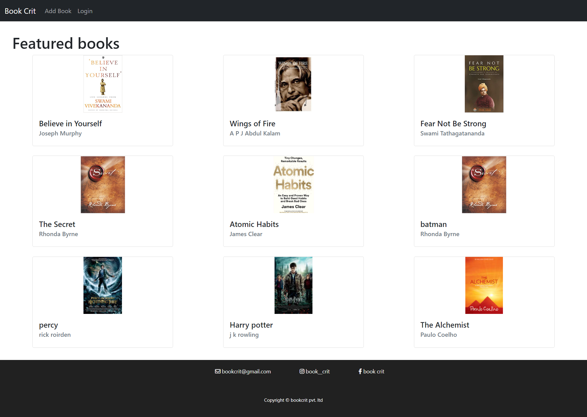
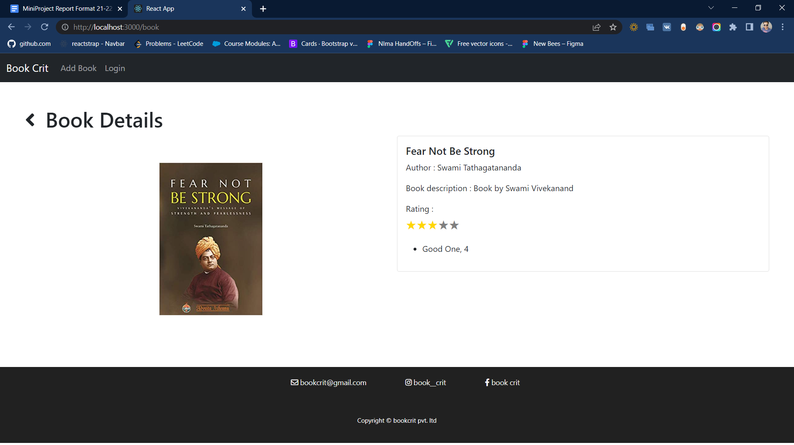
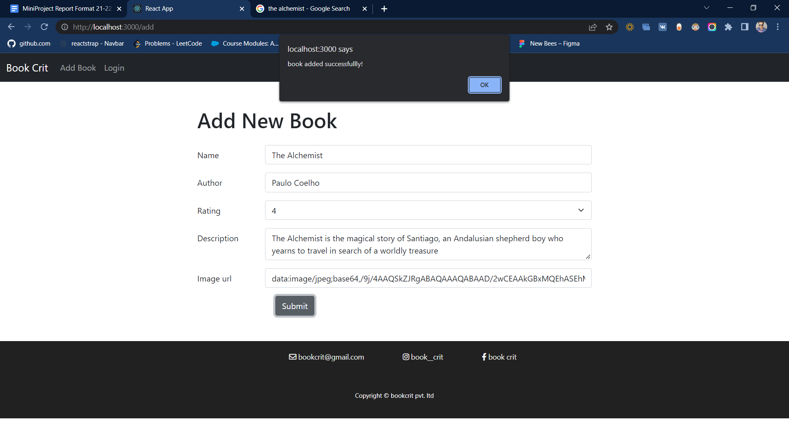

# BookCrit

BookCrit is a full fledged review website where users can easily gain synopsis about the book. A platform where users can post and read reviews, comments and ratings to quickly procure their likelihood with the book. 
This project was created using Node.js, Express, MongoDB, and Bootstrap.

## Features :
  - Users can view book details including their abstract, comments and ratings.
  - User can Upload new book to the collection.

